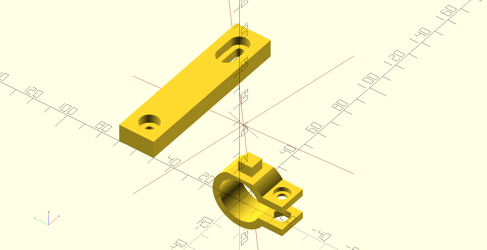

# OpenSCAD bicycle mounts
A OpenSCAD library of things that attach to your bike:

  * handlebar mount
  * bottle cage mount



## Installation
Add a git submodule to your project:

```sh
git submodule add https://github.com/mmalecki/bicycle-mounts bicycle-mounts
```

## Usage
```openscad
use <bicycle-mounts/handlebar.scad>;
use <bicycle-mounts/bottle-cage.scad>;

handlebar_width = 16;

// A handlebar mount, with a cherry on top:
handlebar_mount(width = handlebar_width, angle = 310, top_offset = 2);
to_handlebar_mount_top() {
  translate([handlebar_width / 2, 0])
    color("red")
      cube([8, 8, 8], center = true);
}

// A bottle cage mount:
translate([0, 50]) {
  difference () {
    cube([90, 20, 10]);
    translate([10, 10]) bottle_cage_mount(5);
  }
}
